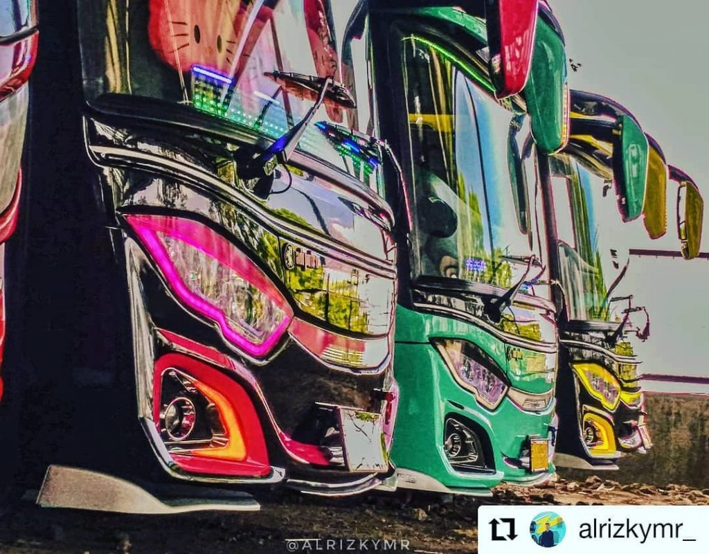

# Tunggal Jaya Transport

<div align="center">
  <!-- Add logo here when available -->
  <p align="center">
    
  </p>
  
  [](LICENSE)
  [](https://laravel.com)
  [](https://www.php.net/)

  Sistem pemesanan transportasi bus modern dibangun dengan Laravel 12
</div>

## 🚐 Tentang Proyek

Tunggal Jaya Transport adalah aplikasi web komprehensif yang dirancang untuk menyederhanakan layanan transportasi bus. Platform ini memungkinkan pengguna untuk memesan tiket bus dengan mudah, mengelola jadwal perjalanan, dan menyediakan solusi lengkap bagi perusahaan transportasi untuk mengelola operasional secara efisien.

Dibangun dengan teknologi web modern, sistem kami menawarkan antarmuka yang ramah pengguna bagi pelanggan dan panel admin yang kuat bagi operator untuk mengelola armada, jadwal, rute, dan pemesanan secara mulus.

### ✨ Fitur Utama

- **Sistem Pemesanan Bus** - Proses pemesanan yang mudah dan intuitif
- **Manajemen Jadwal** - Pembuatan dan modifikasi jadwal secara komprehensif
- **Manajemen Rute** - Definisikan dan kelola rute dengan koordinat
- **Manajemen Kendaraan** - Lacak dan kelola informasi armada bus
- **Manajemen Supir & Kondektur** - Tetapkan personel ke bus
- **Dukungan Multi-bahasa** - Tersedia dalam Bahasa Indonesia dan Inggris
- **Integrasi Pembayaran** - Pemrosesan pembayaran yang aman dengan Midtrans
- **Generasi Tiket** - Pembuatan tiket PDF profesional
- **Otentikasi Pengguna** - Sistem login dan registrasi yang aman
- **Notifikasi Real-time** - Konfirmasi dan pembaruan pemesanan
- **Dashboard Admin** - Kelola semua aspek bisnis transportasi Anda

## 🛠️ Teknologi yang Digunakan

- **Backend**: [Laravel 12](https://laravel.com/) 
- **Frontend**: [Tailwind CSS](https://tailwindcss.com/), [Alpine.js](https://alpinejs.dev/)
- **Database**: [MySQL](https://www.mysql.com/)
- **Payment Gateway**: [Midtrans](https://midtrans.com/)
- **PDF Generation**: [DomPDF](https://github.com/dompdf/dompdf)
- **QR/Barcode**: [Milon/barcode](https://github.com/milon/barcode)
- **Authentication**: Laravel Sanctum/Passport
- **Caching**: Redis/Memcached
- **Queue Management**: Laravel Queues
- **Testing**: PHPUnit, Laravel Dusk
- **Deployment**: Docker, Forge

## 🚀 Instalasi

### Prasyarat

- PHP 8.2 atau lebih tinggi
- Composer (versi 2.0+)
- MySQL 8.0 atau MariaDB 10.5+
- Node.js (versi 18+) & npm
- Git
- Web server (Apache/Nginx) - opsional untuk pengembangan

### Setup Lengkap - Panduan untuk Teman

Ikuti langkah-langkah berikut untuk mengatur proyek ini di lingkungan lokal Anda:

#### 1. Clone repositori

```bash
git clone https://github.com/yourusername/tunggal-jaya-transport.git
cd tunggal-jaya-transport
```

#### 2. Instal dependensi PHP

Pastikan Composer terinstal di sistem Anda, lalu jalankan:

```bash
composer install
```

Jika Anda mendapatkan error karena versi dependensi, coba:
```bash
composer install --ignore-platform-reqs
```

#### 3. Instal dependensi frontend

Pastikan Node.js dan npm terinstal, lalu jalankan:

```bash
npm install
npm run build
# atau untuk pengembangan (akan watch file Anda)
npm run dev
```

#### 4. Setup environment

Salin file `.env.example` ke `.env` dan generate kunci aplikasi:

```bash
copy .env.example .env    # Pada Windows
# atau
cp .env.example .env      # Pada Linux/Mac
```

Setelah itu, generate kunci aplikasi:

```bash
php artisan key:generate
```

#### 5. Konfigurasi database

Anda memiliki dua opsi database:

**Opsi A: Gunakan SQLite (termudah untuk pengembangan)**
- Buka file `.env` dan pastikan konfigurasi berikut:
```env
DB_CONNECTION=sqlite
```
- Pastikan file `database/database.sqlite` ada (script composer biasanya membuatnya otomatis)

**Opsi B: Gunakan MySQL**
- Buat database kosong di MySQL
- Edit file `.env` sesuaikan dengan konfigurasi database Anda:
```env
DB_CONNECTION=mysql
DB_HOST=127.0.0.1
DB_PORT=3306
DB_DATABASE=tunggal_jaya_transport
DB_USERNAME=your_username
DB_PASSWORD=your_password
```

#### 6. Konfigurasi Midtrans (opsional untuk sekarang)

Jika ingin menggunakan fitur pembayaran Midtrans, tambahkan kredensial ke file `.env`:

```env
MIDTRANS_SERVER_KEY=SB-Mid-server-xxxxxxxxxxxxxxxx
MIDTRANS_CLIENT_KEY=SB-Mid-client-xxxxxxxxxxxxxxxx
MIDTRANS_ENVIRONMENT=sandbox
MIDTRANS_PAYMENT_URL=https://app.sandbox.midtrans.com/snap/v1/transactions
MIDTRANS_API_URL=https://api.sandbox.midtrans.com/v2
```

> **Catatan**: Untuk awal, Anda bisa melewati konfigurasi ini dan menggunakannya nanti saat siap menggunakan fitur pembayaran.

#### 7. Jalankan migrasi dan seeder

```bash
php artisan migrate --seed
```

Jika muncul error, coba jalankan perintah satu per satu:
```bash
php artisan migrate
php artisan db:seed
```

#### 8. Setup link penyimpanan

```bash
php artisan storage:link
```

#### 9. Generate passport keys jika diperlukan (jika menggunakan API)

```bash
php artisan passport:install --force
```

#### 10. Jalankan server pengembangan

```bash
php artisan serve
```

Aplikasi akan dapat diakses di `http://localhost:8000`

### Konfigurasi Tambahan (Opsional)

#### WebSockets untuk notifikasi real-time
Jika ingin menggunakan fitur real-time, Anda bisa mengatur Laravel Echo Server:
```bash
npm install -g laravel-echo-server
laravel-echo-server init
```

#### Queue Worker
Untuk memproses tugas-tugas di latar belakang:
```bash
php artisan queue:work
```

## 🔐 Integrasi Gateway Pembayaran Midtrans

Proyek ini mencakup integrasi dengan gateway pembayaran Midtrans untuk pemrosesan pembayaran yang aman:

### Konfigurasi Midtrans

Tambahkan kredensial Midtrans Anda ke file `.env` Anda:

```env
MIDTRANS_SERVER_KEY=SB-Mid-server-xxxxxxxxxxxxxxxx
MIDTRANS_CLIENT_KEY=SB-Mid-client-xxxxxxxxxxxxxxxx
MIDTRANS_ENVIRONMENT=sandbox
MIDTRANS_PAYMENT_URL=https://app.sandbox.midtrans.com/snap/v1/transactions
MIDTRANS_API_URL=https://api.sandbox.midtrans.com/v2
```

### Fitur Pembayaran

- Banyak metode pembayaran (kartu kredit, e-wallet, transfer bank)
- Notifikasi pembayaran real-time
- Pemrosesan transaksi yang aman
- Pembaruan status otomatis
- Kemampuan pengembalian dana

## 🗃️ Struktur Database

Sistem menggunakan struktur database yang dinormalisasi:

- `users` - Informasi akun pengguna
- `roles` - Kontrol akses berbasis peran
- `buses` - Informasi dan spesifikasi kendaraan
- `routes` - Rute transportasi dengan koordinat
- `schedules` - Jadwal keberangkatan dan kedatangan
- `bookings` - Pemesanan pengguna dan status pembayaran
- `drivers` - Profil dan informasi supir
- `conductors` - Profil dan informasi kondektur
- `facilities` - Fasilitas dan fitur bus
- `news_articles` - Berita dan pembaruan terbaru
- `payment_histories` - Log transaksi pembayaran
- `chatbot_knowledge` - Data pelatihan chatbot
- `chatbot_conversations` - Riwayat percakapan chatbot
- `chatbot_messages` - Pesan chatbot individual

## 📝 Penggunaan

### Untuk Pengguna
1. Daftar atau login ke akun Anda
2. Jelajahi rute dan jadwal yang tersedia
3. Pilih tanggal dan waktu perjalanan yang diinginkan
4. Lengkapi pemesanan dengan detail penumpang
5. Lakukan pembayaran melalui gateway pembayaran yang aman
6. Unduh e-tiket dan boarding pass Anda
7. Terima pemberitahuan real-time tentang perjalanan Anda

### Untuk Admin
1. Akses dashboard admin dengan kredensial admin
2. Kelola armada bus, rute, dan jadwal
3. Lihat dan kelola pemesanan pengguna
4. Monitor transaksi pembayaran
5. Perbarui informasi dan harga rute
6. Kelola penugasan supir dan kondektur
7. Hasilkan laporan dan analitik

## 📚 Endpoint API

Aplikasi menyediakan API REST yang komprehensif:

### Otentikasi
- `POST /api/login` - Login pengguna
- `POST /api/register` - Registrasi pengguna
- `POST /api/logout` - Logout pengguna
- `GET /api/user` - Mendapatkan pengguna yang terotentikasi

### Sistem Pemesanan
- `GET /api/schedules` - Mendapatkan jadwal yang tersedia
- `POST /api/bookings` - Membuat pemesanan baru
- `GET /api/bookings/{id}` - Mendapatkan pemesanan tertentu
- `PUT /api/bookings/{id}/payment` - Proses pembayaran
- `GET /api/bookings/user/{userId}` - Mendapatkan pemesanan pengguna

### Data Transportasi
- `GET /api/routes` - Mendapatkan semua rute
- `GET /api/buses` - Mendapatkan semua bus
- `GET /api/drivers` - Mendapatkan semua supir

### Integrasi Pembayaran
- `POST /api/payment/process` - Proses pembayaran dengan Midtrans
- `POST /api/payment/webhook` - Handler webhook Midtrans
- `GET /api/payment/status/{orderId}` - Cek status pembayaran

## 🧪 Pengujian

Jalankan pengujian aplikasi:

```bash
# Jalankan tes unit
php artisan test

# Jalankan tes fitur
php artisan test --testsuite=Feature

# Jalankan semua tes dengan cakupan
php artisan test --coverage
```

## 🤝 Kontribusi

Kami menyambut kontribusi untuk membuat Tunggal Jaya Transport menjadi lebih baik! Berikut cara Anda dapat membantu:

1. Fork repositori
2. Buat branch fitur Anda (`git checkout -b feature/AmazingFeature`)
3. Commit perubahan Anda (`git commit -m 'Add some AmazingFeature'`)
4. Push ke branch (`git push origin feature/AmazingFeature`)
5. Buka Pull Request

Harap pastikan untuk memperbarui tes sesuai kebutuhan dan ikuti standar pengkodean kami.

### Pedoman Pengembangan

- Ikuti standar pengkodean PSR-12
- Tulis pesan commit yang bermakna
- Tambahkan dokumentasi yang tepat
- Sertakan tes untuk fitur baru
- Pastikan semua tes lulus sebelum mengirimkan

## 🚀 Deployment

### Deployment Produksi

1. **Siapkan server Anda** dengan PHP 8.2+, MySQL, dan ekstensi yang diperlukan
2. **Klon repositori** ke server produksi Anda
3. **Instal dependensi** dengan Composer dan npm
4. **Konfigurasi variabel lingkungan** termasuk kredensial database dan gateway pembayaran
5. **Jalankan migrasi dan seeder** untuk menyiapkan database
6. **Siapkan server web** (Apache/Nginx) untuk menunjuk ke direktori `public`
7. **Konfigurasi worker antrian** untuk pemrosesan latar belakang
8. **Siapkan tugas terjadwal** untuk operasi berulang

### Variabel Lingkungan untuk Produksi

```env
APP_ENV=production
APP_DEBUG=false
APP_URL=https://yourdomain.com

# Konfigurasi database
DB_HOST=your_db_host
DB_PORT=3306
DB_DATABASE=your_database_name
DB_USERNAME=your_db_username
DB_PASSWORD=your_db_password

# Kunci Produksi Midtrans
MIDTRANS_SERVER_KEY=Mid-server-xxxxxxxxxxxxxxxx
MIDTRANS_CLIENT_KEY=Mid-client-xxxxxxxxxxxxxxxx
MIDTRANS_ENVIRONMENT=production

# Konfigurasi antrian
QUEUE_CONNECTION=redis
REDIS_URL=redis://localhost:6379

# Konfigurasi email
MAIL_MAILER=smtp
MAIL_HOST=smtp.yourhost.com
MAIL_PORT=587
MAIL_USERNAME=your_mail_username
MAIL_PASSWORD=your_mail_password
```

## 🐛 Masalah yang Diketahui

- Generasi tiket PDF mungkin memiliki masalah tampilan di beberapa pembaca PDF
- Masalah timeout sesekali dengan pemrosesan pembayaran selama lalu lintas tinggi
- Beberapa masalah responsifitas mobile dengan formulir kompleks

## ❗ Troubleshooting dan Error yang Sering Terjadi

Berikut adalah solusi untuk beberapa error umum saat setup:

### 1. Error saat composer install
**Error**: `Your PHP version (8.1.x) is not compatible with your Laravel version`
- **Solusi**: Pastikan Anda menggunakan PHP 8.2 atau lebih tinggi

**Error**: `Failed to download [package-name]`
- **Solusi**: Coba perbarui Composer: `composer self-update`
- atau gunakan `composer install --ignore-platform-reqs`

### 2. Error migrasi database
**Error**: `PDOException: could not find driver (SQLITE)`
- **Solusi**: Pastikan ekstensi SQLite diaktifkan di PHP Anda (cek php.ini)

**Error**: `Access denied for user 'username'@'localhost'`
- **Solusi**: Periksa kembali konfigurasi database di file `.env`

### 3. Error saat artisan key:generate
**Error**: `file_put_contents(.env): failed to open stream: Permission denied`
- **Solusi**: Pastikan file `.env` dapat ditulis (chmod 644 di Linux/Mac)

### 4. Error saat npm install
**Error**: `node-sass` error
- **Solusi**: Ganti dengan `dart-sass` atau gunakan `npm install --legacy-peer-deps`

### 5. Tidak bisa mengakses halaman
**Jika muncul error "404 Not Found" saat mengakses http://localhost:8000**:
- Pastikan folder `public` digunakan sebagai root directory
- Jalankan `php artisan serve` bukan server web lain

**Jika muncul error "500 Internal Server Error"**:
- Periksa file `storage/logs/laravel.log` untuk detail error
- Pastikan folder `storage` dan `bootstrap/cache` dapat ditulis (chmod 755 atau 777)

### 6. Error saat menjalankan migrasi
**Jika muncul error "Base table or view not found: sessions table"**:
- Jalankan: `php artisan migrate:fresh --seed`

### 7. Error "Maximum execution time exceeded"
- Tambahkan `set_time_limit(300);` di awal file artisan atau
- Tambahkan `max_execution_time = 300` di file php.ini

### 8. Jika muncul error "Call to undefined function imagecreate()"
- Pastikan ekstensi GD diaktifkan di PHP
- Di file `php.ini`, pastikan `extension=gd` tidak dikomentari

### 9. Jika muncul error saat mengakses file upload
- Pastikan folder `storage/app/public` dapat ditulis
- Jalankan `php artisan storage:link` dan cek jika link sudah dibuat

### 10. Jika npm run dev tidak bekerja
- Coba `npm run build` sebagai alternatif
- Atau coba versi yang kompatibel: `npx vite build`

### 11. Jika login atau session tidak berfungsi
- Pastikan `SESSION_DRIVER` di file `.env` diatur dengan benar (database/file)
- Jalankan migrasi untuk tabel sessions: `php artisan migrate`

### 12. Jika QR Code atau Barcode tidak muncul di tiket
- Pastikan modul GD dan ImageMagick aktif di PHP
- Periksa apakah folder penyimpanan sementara dapat ditulis

Jika Anda mengalami error lain yang tidak tercantum di sini, periksa file log di `storage/logs/laravel.log` untuk detail error yang lebih lengkap.

## 📞 Dukungan

Jika Anda mengalami masalah atau memiliki pertanyaan tentang aplikasi:

- **Issues**: Laporkan masalah di halaman [GitHub Issues](https://github.com/yourusername/tunggal-jaya-transport/issues)
- **Email**: Hubungi tim dukungan kami di support@tunggaljaya.com
- **Dokumentasi**: Periksa dokumentasi lengkap kami di direktori `docs/`

## 📄 Lisensi

Proyek ini dilisensikan di bawah Lisensi MIT - lihat file [LICENSE](LICENSE) untuk detailnya.

## 🙏 Ucapan Terima Kasih

- Framework Laravel dan para kontributornya
- Midtrans untuk solusi gateway pembayaran
- Semua paket open-source yang digunakan dalam proyek ini
- Pengembang yang berkontribusi pada basis kode
- Pengguna kami yang memberikan umpan balik berharga untuk perbaikan

---
<div align="center">
  <p>Dibuat dengan ❤️ untuk tim Tunggal Jaya Transport</p>
  <p>© 2025 Tunggal Jaya Transport. Hak cipta dilindungi.</p>
</div>