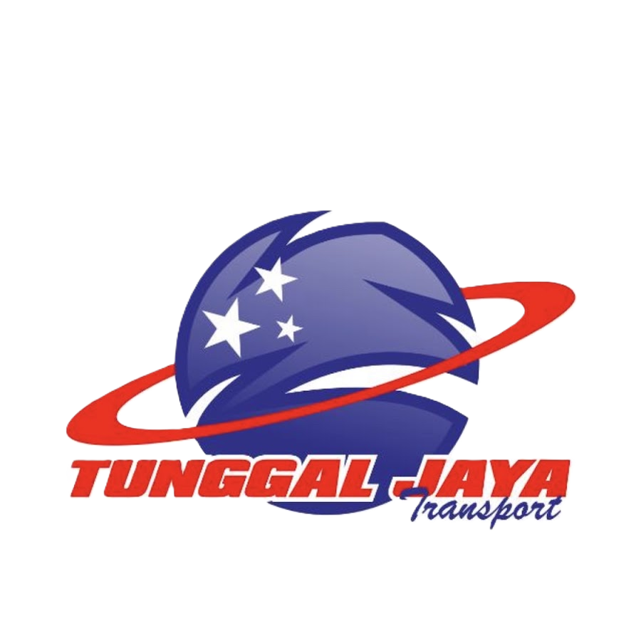
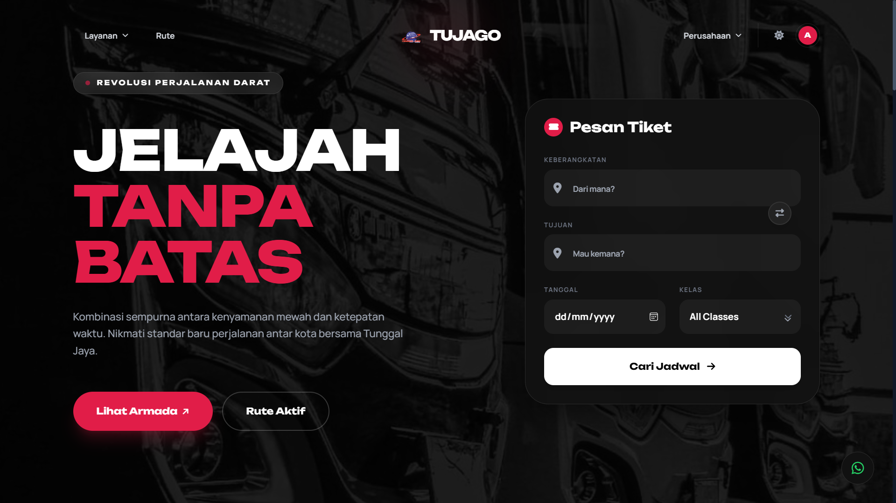
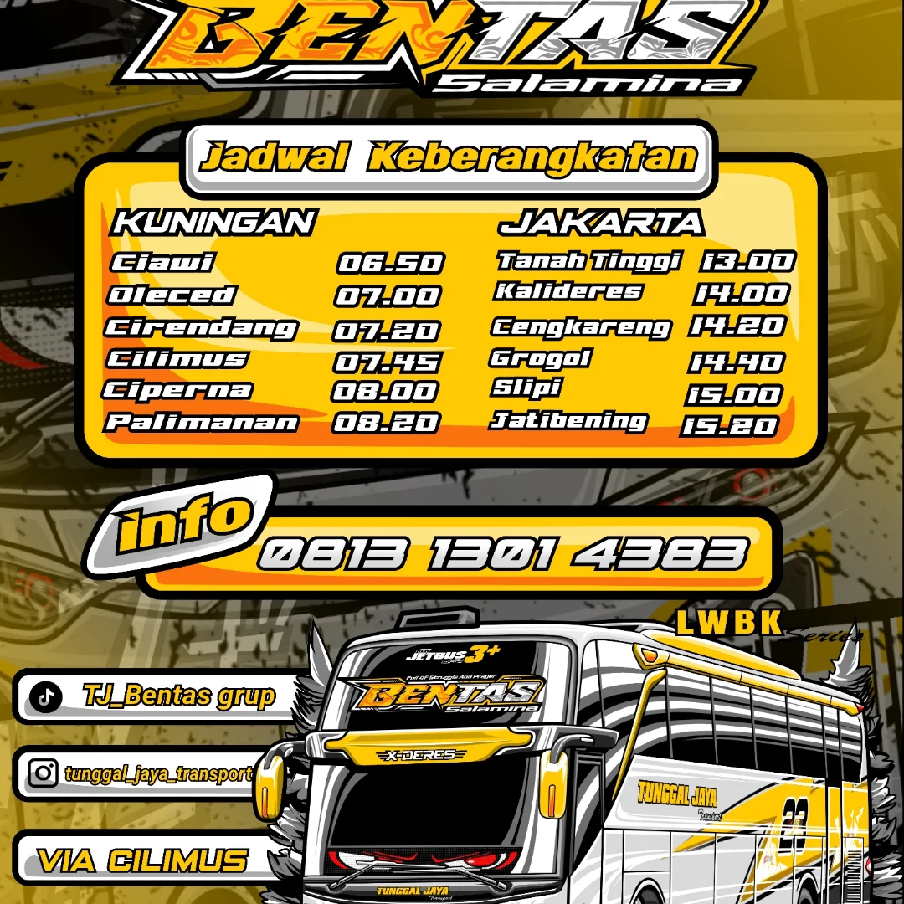
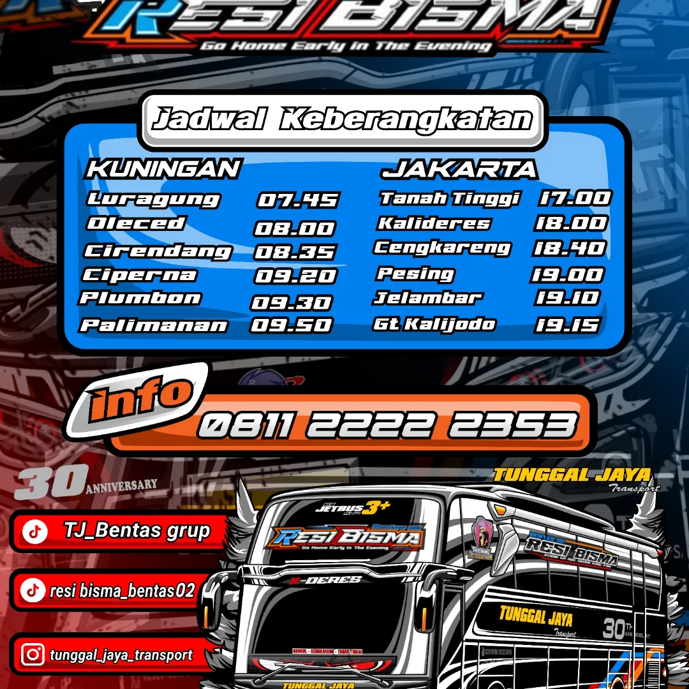
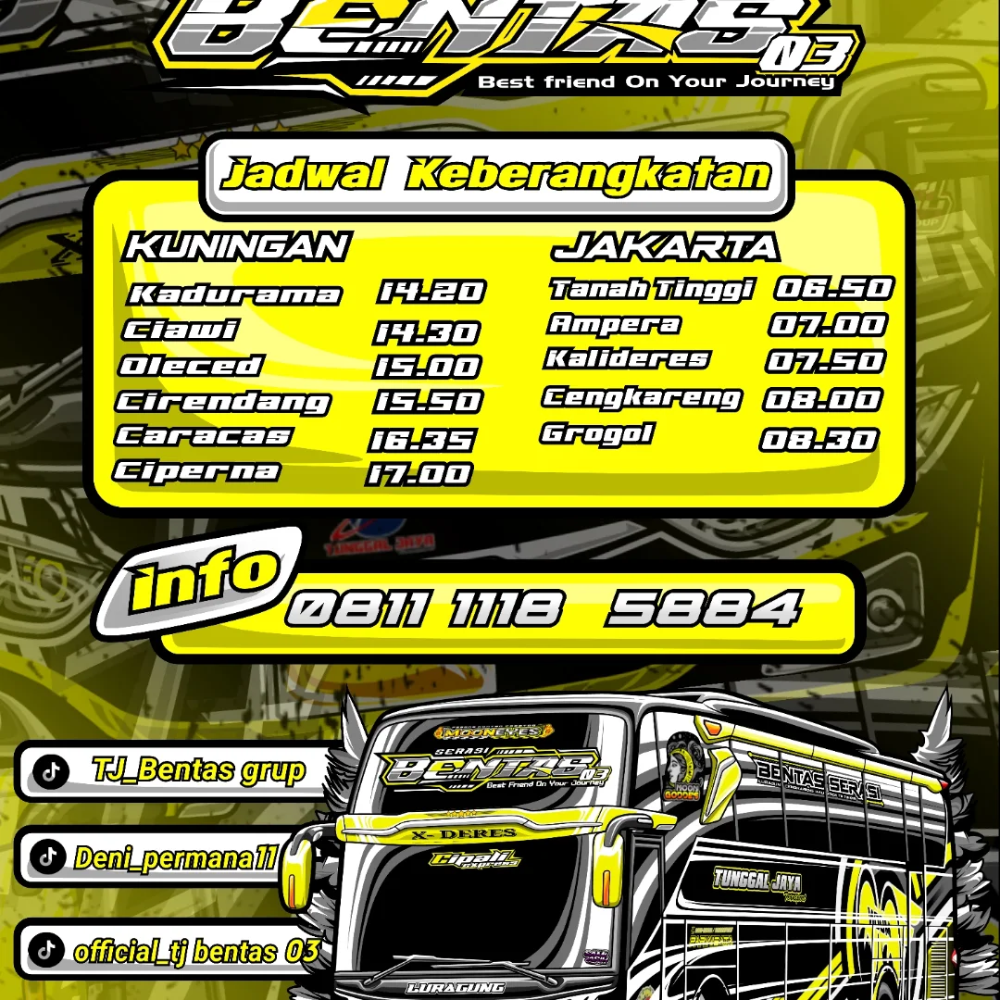
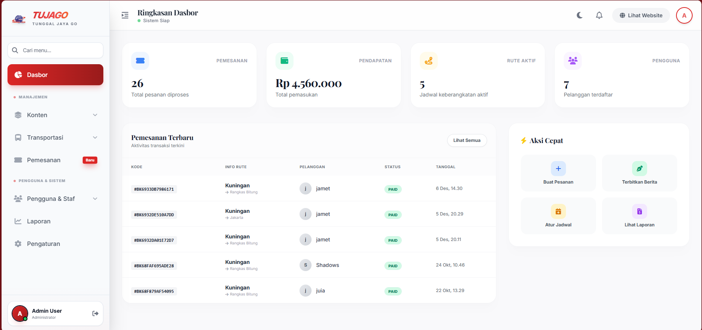
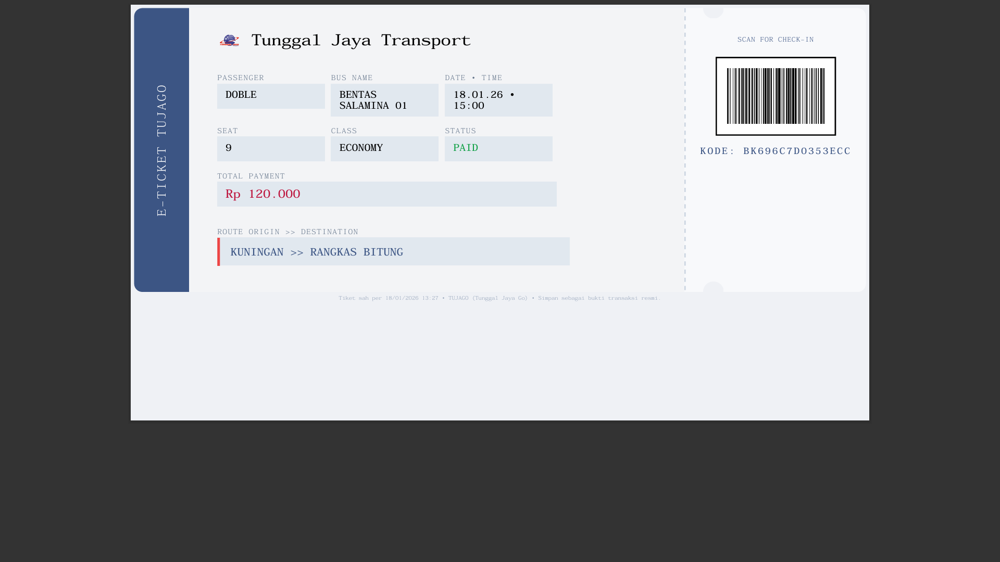
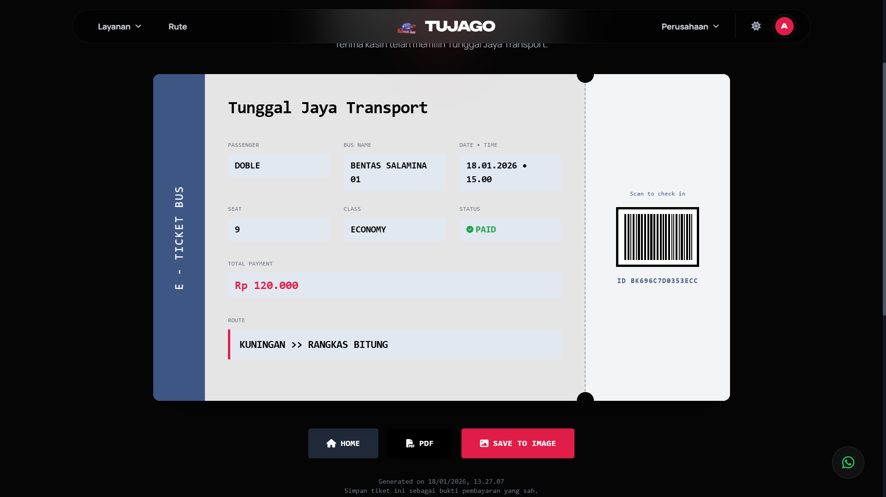

# Tunggal Jaya Transport - Premium Bus Booking System

<div align="center">
  
  <br/>
  <br/>

[](LICENSE)
[](https://laravel.com)
[](https://vuejs.org/)
[](https://tailwindcss.com/)

**Platform Pemesanan Tiket Bus Modern dengan Estetika Premium & UI/UX Kelas Atas**

  <p align="center">
    <a href="#-fitur-unggulan">Fitur</a> •
    <a href="#-galeri">Galeri</a> •
    <a href="#-teknologi">Teknologi</a> •
    <a href="#-instalasi">Instalasi</a>
  </p>
</div>

---

## 🚌 Tentang Proyek

**Tunggal Jaya Transport** adalah solusi digital end-to-end untuk perusahaan transportasi bus. Dirancang dengan fokus pada **User Experience (UX) Premium**, sistem ini menggabungkan kemudahan pemesanan tiket bagi penumpang dengan dashboard manajemen yang powerful bagi admin.

### ✨ Highlights

- **Desain Mewah:** Mengusung tema "Noir Glassmorphism" dengan dominasi warna hitam, putih, dan aksen Rose Gold.
- **Interaktif:** Animasi halus menggunakan GASP & Framer Motion.
- **Responsif:** Tampilan optimal di Desktop, Tablet, dan Mobile.

---

## 🖼️ Galeri Tampilan

### 🏠 Landing Page & Info Perjalanan

<div align="center">
  
  
  <p><em>Section Info Perjalanan Baru dengan Poster Interaktif</em></p>
  <div style="display: flex; gap: 10px; justify-content: center; margin-top: 10px;">
    
    
    
  </div>
</div>

### 📊 Dashboard Admin & Analitik

<div align="center">
  <br/>
  
  <p><em>Dashboard dengan Grafik Analitik Pendapatan Real-time & Manajemen Okupansi</em></p>
</div>

### 🎫 E-Ticket & PDF

<div align="center">
  <br/>
  
  
</div>

---

## ✨ Fitur Unggulan

### 🛍️ Untuk Penumpang

- **Sistem Booking Intuitif**: Pilih rute, tanggal, dan kursi dengan visualisasi denah kursi (Seat Selection).
- **Pembayaran Midtrans**: Support berbagai metode pembayaran (QRIS, VA, E-Wallet).
- **Kode Promo**: Gunakan kode unik untuk mendapatkan diskon (Persentase/Nominal).
- **Notifikasi WhatsApp**: E-Ticket dan Reminder keberangkatan H-1 otomatis terkirim ke WA.
- **Flash Sale Banner**: Info promo menarik langsung di halaman depan.

### 🛠️ Untuk Admin

- **Dashboard Analytics**: Grafik tren pendapatan, rute populer, dan jam sibuk (ApexCharts).
- **Manajemen Armada & Rute**: Kelola bus, fasilitas, harga, dan jadwal keberangkatan.
- **Laporan Okupansi**: Cek keterisian kursi per keberangkatan.
- **Manajemen Kode Promo**: Buat dan atur kuota kode diskon.
- **Validasi Tiket**: Scan QR Code tiket penumpang.

---

## 🛠️ Teknologi

- **Backend**: Laravel 11.x
- **Frontend**: Vue.js 3 (Composition API) + Inertia.js
- **Styling**: Tailwind CSS + Custom Design System
- **Database**: MySQL 8.0
- **Integrasi Pihak Ketiga**:
    - **Midtrans**: Payment Gateway (Snap API)
    - **Fonnte**: WhatsApp API Gateway
    - **ApexCharts**: Data Visualization

---

## 🚀 Instalasi & Konfigurasi

Ikuti langkah ini untuk menjalankan project di local:

1. **Clone Repositori**

    ```bash
    git clone https://github.com/your-repo/tunggal-jaya-transport.git
    cd tunggal-jaya-transport
    ```

2. **Setup Backend**

    ```bash
    composer install
    cp .env.example .env
    php artisan key:generate
    ```

3. **Setup Database & Environment**
   Edit file `.env` dan sesuaikan kredensial database, serta API Key:

    ```env
    DB_DATABASE=laravel_tunggal_jaya_db

    # Midtrans
    MIDTRANS_SERVER_KEY=your-server-key
    MIDTRANS_CLIENT_KEY=your-client-key

    # Fonnte (WhatsApp)
    FONNTE_TOKEN=your-fonnte-token
    ```

4. **Migrasi & Seeding**

    ```bash
    php artisan migrate --seed
    ```

    _Seeder akan membuat akun admin default dan data dummy armada._

5. **Setup Frontend**

    ```bash
    npm install
    npm run build
    ```

6. **Jalankan Project**

    ```bash
    # Terminal 1
    php artisan serve

    # Terminal 2 (jika mode dev)
    npm run dev
    ```

7. **Scheduler (Opsional)**
   Untuk fitur reminder H-1 WhatsApp, jalankan scheduler:
    ```bash
    php artisan schedule:work
    ```

---

## 🔒 Lisensi

Project ini dilisensikan di bawah [MIT License](LICENSE).
<br/>
© 2024-2025 **Tunggal Jaya Transport**. Dibuat dengan ❤️ dan ☕.
