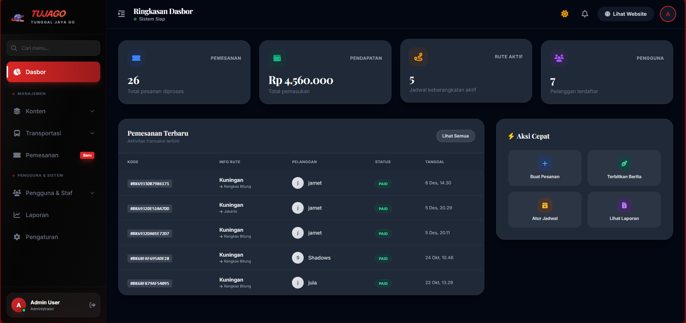

# Tunggal Jaya Transport - Premium Bus Booking System

<div align="center">
  
  <br/>
  <br/>

[](LICENSE)
[](https://laravel.com)
[](https://www.php.net/)
[](https://tailwindcss.com/)

**Platform Pemesanan Tiket Bus Modern dengan Estetika Premium & UI/UX Kelas Atas**

  <p align="center">
    <a href="#-fitur-unggulan">Fitur</a> •
    <a href="#-teknologi">Teknologi</a> •
    <a href="#-instalasi">Instalasi</a> •
    <a href="#-dokumentasi">Dokumentasi</a>
  </p>
</div>

---

## 🚌 Tentang Proyek

**Tunggal Jaya Transport** bukan sekadar aplikasi pemesanan tiket biasa. Ini adalah solusi digital komprehensif yang dirancang untuk memberikan pengalaman **Premium & Elegan** bagi pengguna.

Dengan desain antarmuka yang memukau (**Glassmorphism**, **Parallax**, **Micro-interactions**), kami mengubah cara pelanggan memesan tiket bus menjadi pengalaman yang menyenangkan dan modern.

### 🖼️ Galeri Tampilan

<div align="center">
  <h3>✨ Halaman Beranda Premium</h3>
  
  <p><em>Desain modern dengan hero section full-screen, animasi scroll, dan kartu interaktif.</em></p>
</div>

<br/>

<div align="center">
  <table>
    <tr>
      <td align="center">
        <h3>🌓 Mode Gelap Admin</h3>
        
      </td>
      <td align="center">
        <h3>☀️ Mode Terang Admin</h3>
        
      </td>
    </tr>
  </table>
</div>

---

## ✨ Fitur Unggulan

### 🎨 User Interface (UI) Kelas Atas

-   **Glassmorphism Design**: Efek transparan yang elegan pada formulir dan kartu.
-   **Scroll Reveal Animations**: Elemen muncul secara dinamis saat digulir.
-   **Floating Labels**: Input formulir modern yang interaktif dan responsif.
-   **Organic Shape Dividers**: Pemisah antar-bagian yang halus dan tidak kaku.
-   **Parallax Effects**: Kedalaman visual pada latar belakang hero.

### 🛠️ Fungsionalitas Inti

-   **Pemesanan Mudah**: Alur pemesanan tiket yang intuitif (Cari -> Pilih Kursi -> Bayar).
-   **Manajemen Armada Lengkap**: Kelola data bus, fasilitas, dan status ketersediaan.
-   **Integrasi Pembayaran**: Dukungan penuh Gateway Pembayaran (Midtrans).
-   **E-Ticket PDF**: Generasi tiket otomatis dengan QR Code validasi.
-   **Dashboard Admin Powerful**: Analitik real-time, manajemen rute, jadwal, dan pengguna.

---

## 🛠️ Teknologi yang Digunakan

Aplikasi ini dibangun di atas fondasi teknologi yang kokoh dan modern:

-   **Backend**: [Laravel 12](https://laravel.com/) (Framework PHP Paling Populer)
-   **Frontend**:
    -   [Vue.js 3](https://vuejs.org/) (Interaktivitas)
    -   [Inertia.js](https://inertiajs.com/) (Penghubung Monolith Modern)
    -   [Tailwind CSS](https://tailwindcss.com/) (Styling Utility-First)
-   **Database**: MySQL 8.0+
-   **Pembayaran**: Midtrans Payment Gateway
-   **Aset**: FontAwesome 6 Pro, Google Fonts (Inter & Playfair Display)

---

## 🚀 Instalasi & Memulai

Ikuti panduan ini untuk menjalankan proyek di komputer lokal Anda:

### Prasyarat

-   PHP 8.2+
-   Composer
-   Node.js & NPM
-   Database MySQL

### Langkah-langkah

1. **Clone Repositori**

    ```bash
    git clone https://github.com/yourusername/tunggal-jaya-transport.git
    cd tunggal-jaya-transport
    ```

2. **Instal Dependensi**

    ```bash
    composer install
    npm install
    ```

3. **Konfigurasi Lingkungan (.env)**
   Salin file `.env.example` menjadi `.env` dan atur database Anda.

    ```bash
    cp .env.example .env
    php artisan key:generate
    ```

    _Edit file .env dan sesuaikan `DB_DATABASE`, `DB_USERNAME`, dll._

4. **Migrasi Database & Seeding**

    ```bash
    php artisan migrate --seed
    ```

    _Ini akan membuat tabel dan mengisi data dummy (admin, bus, rute)._

5. **Jalankan Aplikasi**
   Buka dua terminal terpisah:

    ```bash
    # Terminal 1 (Backend)
    php artisan serve

    # Terminal 2 (Frontend)
    npm run dev
    ```

6. **Selesai!**
   Buka browser dan akses: `http://localhost:8000`

---

## 🔒 Keamanan & Lisensi

Proyek ini menerapkan standar keamanan industri termasuk perlindungan CSRF, XSS, dan sanitasi input.
Dilisensikan di bawah **MIT License**. Bebas untuk dikembangkan dan dimodifikasi.

---

<div align="center">
  <p><strong>Tunggal Jaya Transport</strong></p>
  <p><em>Menghubungkan Kota, Mengantar Bahagia.</em></p>
  <p>© 2025 by Developer Team</p>
</div>
