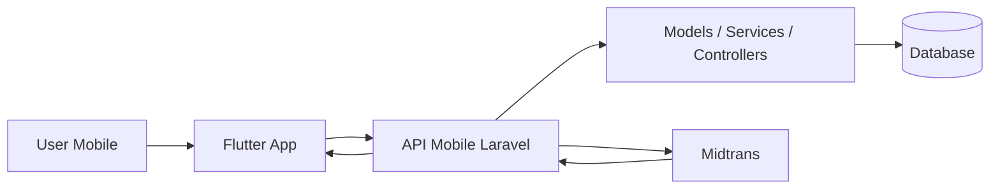

# Flutter Mobile Go-Live Guide — TunggalJayaTransport

Dokumen ini adalah ringkasan paling lengkap untuk menyiapkan aplikasi mobile Flutter sampai siap dipakai.

Kalau tujuan Anda adalah membuat mobile app yang benar-benar bisa jalan, dokumen ini menjadi master reference.

Dokumen pendamping:

- [Flutter Mobile App Plan](FLUTTER_MOBILE_APP_PLAN.md)
- [Flutter Mobile Setup Guide](FLUTTER_MOBILE_SETUP_GUIDE.md)
- [Flutter Mobile UI Design](FLUTTER_MOBILE_UI_DESIGN.md)
- [Flutter Mobile Backend Reference](FLUTTER_MOBILE_BACKEND_REFERENCE.md)

## 1. Tujuan Produk

Mobile app Flutter dipakai untuk:

- cari jadwal bus
- pilih kursi
- booking tiket
- bayar lewat Midtrans
- lihat tiket dan riwayat booking
- baca berita dan lihat armada
- login, register, reset password, verifikasi phone/email

## 2. Prinsip Implementasi

- Laravel tetap jadi source of truth.
- Flutter hanya client mobile.
- Auth mobile memakai Sanctum token.
- Booking dan payment harus divalidasi server.
- UI harus modern, simple, dan konsisten.

## 3. Target Release Scope

### Wajib di rilis pertama

- auth login/register/logout
- home
- search jadwal
- detail jadwal
- seat selection
- booking flow
- payment Midtrans
- booking history
- ticket detail
- profile dasar

### Bisa menyusul setelah release awal

- forgot password via OTP/link
- push notification
- favorite route
- advanced filter
- dark mode
- review / rating

## 4. Stack Yang Dipakai

### Flutter side

- Flutter stable
- Dio
- GoRouter
- Secure storage
- Riverpod atau Bloc
- Freezed + json_serializable
- Intl
- Cached network image
- WebView untuk Midtrans

### Laravel side

- Laravel 12
- Sanctum
- Midtrans
- existing booking/payment logic
- existing models, services, controllers

## 5. Arsitektur Tingkat Tinggi



### Pola data

- Flutter kirim request JSON.
- Laravel validasi dan proses bisnis.
- Laravel balas response JSON konsisten.
- Flutter render UI berdasarkan response.

## 6. Struktur Folder Yang Disarankan

### Flutter

- `lib/core/`
    - config
    - constants
    - network
    - storage
    - utils
- `lib/features/auth/`
- `lib/features/home/`
- `lib/features/search/`
- `lib/features/routes/`
- `lib/features/booking/`
- `lib/features/payment/`
- `lib/features/tickets/`
- `lib/features/news/`
- `lib/features/fleet/`
- `lib/features/profile/`

### Isi tiap feature

- `data/`
    - models
    - repositories
    - datasources
- `presentation/`
    - pages
    - widgets
    - state management

## 7. Design System Singkat

Rujukan detail desain ada di [Flutter Mobile UI Design](FLUTTER_MOBILE_UI_DESIGN.md).

### Ringkasan gaya

- minimal modern
- warna netral dominan
- satu warna primary
- satu accent saja
- icon satu family
- button tegas dan tidak ramai

### Navigasi

- bottom navigation 4-5 tab
- detail page pakai push navigation
- booking flow step-by-step
- payment layar khusus

## 8. Screen Map

### Bottom navigation yang disarankan

1. Home
2. Search
3. Trips / Booking
4. News
5. Profile

### Urutan layar utama

1. Splash
2. Login / Register
3. Home
4. Search result
5. Route / schedule detail
6. Seat selection
7. Booking form
8. Payment
9. Ticket / success
10. History
11. Profile

## 9. Halaman Dan Isi Utamanya

### Home

- greeting
- search card
- shortcut action
- featured routes
- latest news
- fleet preview

### Search

- origin
- destination
- date
- class
- time
- result cards

### Route detail

- ringkasan route
- estimasi durasi
- harga
- jadwal terkait

### Seat selection

- seat map
- legend
- selected seat counter
- lanjutkan button

### Booking form

- passenger info
- promo code
- review summary

### Payment

- order summary
- payment method
- pay button

### Ticket

- booking code
- route detail
- seat list
- payment status
- download/share

### History

- active
- completed
- expired/cancelled

### Profile

- user info
- verification status
- settings
- logout

## 10. API Strategy

### Prinsip

- semua request mobile ke API khusus
- response JSON konsisten
- pakai token auth
- endpoint publik dipisah dari endpoint proteksi

### Prefix yang disarankan

- `GET /api/mobile/home`
- `POST /api/mobile/auth/login`
- `POST /api/mobile/auth/register`
- `POST /api/mobile/auth/logout`
- `GET /api/mobile/routes`
- `GET /api/mobile/schedules`
- `POST /api/mobile/bookings`
- `POST /api/mobile/payments/process`
- `GET /api/mobile/bookings/{id}`

### Response standard

```json
{
    "success": true,
    "message": "OK",
    "data": {}
}
```

### Error standard

```json
{
    "success": false,
    "message": "Validation failed",
    "errors": {}
}
```

## 11. Auth Flow

### Login

1. Flutter kirim email/phone dan password.
2. Laravel validasi.
3. Laravel buat token Sanctum.
4. Flutter simpan token di secure storage.
5. Flutter redirect ke home.

### Logout

1. Flutter panggil logout.
2. Token dihapus.
3. State user di-reset.
4. User balik ke login.

### Reset password

Disiapkan sebagai flow terpisah jika sudah mau dirilis.

## 12. Booking Flow End-to-End

1. User cari jadwal.
2. User pilih jadwal.
3. Flutter cek availability.
4. User pilih kursi.
5. Flutter kirim data penumpang.
6. Backend buat booking.
7. Backend kirim order/payment payload.
8. Flutter buka Midtrans checkout.
9. Backend update payment status via webhook.
10. Flutter refresh status dan tampilkan ticket.

## 13. Payment Flow

### Yang wajib ada

- `snap_token`
- `redirect_url`
- status check endpoint
- webhook listener

### Prinsip keamanan

- jangan percaya status lokal saja
- webhook server tetap final
- booking harus punya batas waktu pembayaran

## 14. Environment Setup

### Flutter `.env`

```env
API_BASE_URL=http://10.0.2.2:8000
API_PREFIX=/api/mobile
APP_NAME=Tunggal Jaya Transport
```

### Base URL catatan

- Android emulator: `10.0.2.2`
- device fisik: IP lokal
- production: domain resmi

## 15. Asset Dan Branding

Siapkan:

- logo aplikasi
- logo utama perusahaan
- placeholder image
- icon payment
- icon menu
- splash background

## 16. Komponen Reusable

### Komponen minimal

- AppScaffold
- AppBarSimple
- PrimaryButton
- SecondaryButton
- TextInputField
- StatusBadge
- SearchFilterChip
- ScheduleCard
- RouteCard
- FleetCard
- NewsCard
- BookingCard
- PaymentMethodCard
- SeatTile
- EmptyStateView
- ErrorStateView
- LoadingShimmer

## 17. State Management

### Pilihan yang cocok

- Riverpod untuk fleksibilitas dan struktur ringan
- Bloc untuk event/state yang lebih formal

### State penting

- auth state
- user profile state
- search state
- booking draft state
- payment state
- history state

## 18. Validasi Dan Error Handling

### Wajib ditangani

- 401 unauthorized
- 403 forbidden
- 422 validation error
- 429 rate limit
- 500 server error
- timeout
- offline mode

### UX error yang baik

- pesan singkat
- jelas apa yang harus dilakukan user
- tombol retry
- jangan tampilkan error teknis mentah ke user

## 19. Testing Checklist

### Auth

- login success
- login fail
- register validation
- logout

### Booking

- search result muncul
- seat tidak double select
- booking create berhasil
- promo validasi jalan

### Payment

- snap token diterima
- webview buka payment
- status pembayaran update

### UI

- layout aman di layar kecil
- bottom nav konsisten
- loading state tampil
- empty state tampil

## 20. Release Checklist

### Sebelum build release

- [ ] endpoint API mobile siap
- [ ] token auth aktif
- [ ] payment flow teruji
- [ ] webhook Midtrans aktif
- [ ] semua screen utama siap
- [ ] error handling selesai
- [ ] icon dan splash sudah ada
- [ ] base URL production sudah disiapkan

### Build

- Android: `flutter build apk` atau `flutter build appbundle`
- iOS: build dari Xcode / archive

### Setelah build

- test login
- test search
- test booking
- test payment
- test history

## 21. Definition of Done

Aplikasi mobile bisa dianggap siap bila:

- user bisa login dan logout
- user bisa cari jadwal
- user bisa booking kursi
- user bisa bayar
- user bisa lihat tiket
- user bisa lihat riwayat booking
- backend dan mobile sinkron
- UI konsisten dan tidak ramai
- error handling aman

## 22. Rekomendasi Implementasi Bertahap

### Phase 1

- setup Flutter project
- setup design system
- setup routing
- setup auth

### Phase 2

- home
- search
- route detail
- fleet dan news

### Phase 3

- booking
- seat selection
- promo

### Phase 4

- payment
- webhook sync
- ticket

### Phase 5

- history
- profile
- polish

## 23. Hal Yang Jangan Dilakukan

- jangan pakai session web untuk mobile auth
- jangan gabung terlalu banyak warna
- jangan bikin navigasi terlalu dalam tanpa alasan
- jangan simpan token secara tidak aman
- jangan percaya payment status hanya dari client

## 24. Kesimpulan

Kalau mengikuti dokumen ini, setup mobile app Flutter untuk TunggalJayaTransport sudah berada di jalur yang benar: struktur rapi, desain konsisten, API jelas, dan flow booking/payment aman.

Ini bukan sekadar draft. Ini sudah cukup untuk jadi dasar implementasi dan go-live bertahap.
